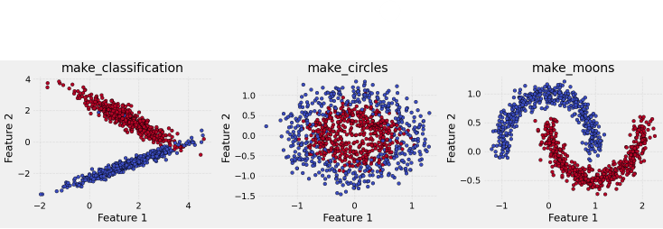
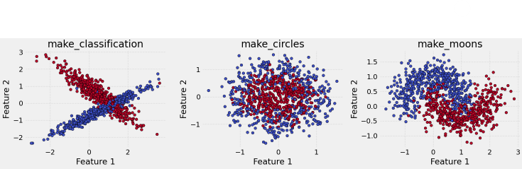
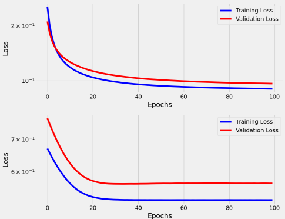
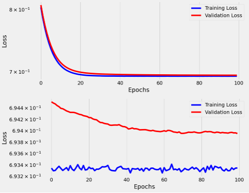
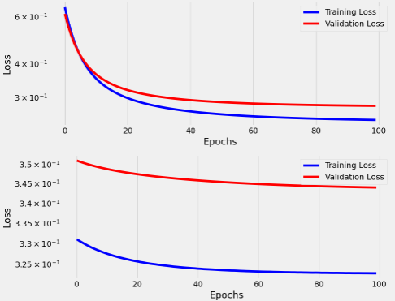

# Desafio de Classificação Binária com PyTorch 

## 📌 Descrição do Projeto

Este projeto é um desafio prático de classificação binária implementado em PyTorch, focado em explorar o impacto de diferentes configurações na performance e decisão de um modelo de **Regressão Logística**.

O principal objetivo foi analisar como a **separabilidade dos dados (ruído)** e a **escolha da função de perda (Loss Function)** afetam a convergência do modelo e as métricas de avaliação.

### 🛠️ Requisitos Técnicos

1.  **Modelo:** Regressão Logística implementada em PyTorch.
2.  **Arquitetura:** Utilização obrigatória da classe `Architecture` fornecida em aula.
3.  **Dados:** Três datasets sintéticos gerados com `sklearn.datasets` (`make_classification`, `make_circles`, `make_moons`), simulando diferentes níveis de separabilidade e complexidade.
4.  **Funções de Perda (Loss Functions):** Análise e comparação entre `nn.BCELoss` e `nn.BCEWithLogitsLoss`.

---
## 🔬 Experimentos Realizados

O modelo de Regressão Logística foi treinado por 100 épocas em três datasets normalizados.

### 1. Análise de Ruído e Complexidade dos Dados

Foram utilizados três datasets com diferentes características de separabilidade, simulando um aumento na complexidade e ruído dos dados.

| Dataset | Função de Geração | Separabilidade / Ruído | Desempenho Esperado da Reg. Logística |
| :--- | :--- | :--- | :--- |
| **Dataset 1** | `make_classification` | Linearmente separável (Alta Sep.) | Excelente |
| **Dataset 2** | `make_circles` | Não-linear (Ruído Médio) | Ruim (A fronteira linear é inadequada) |
| **Dataset 3** | `make_moons` | Não-linear (Baixo Ruído) | Bom (O modelo encontra uma fronteira linear aceitável para parte dos dados) |

**Observações sobre Convergência (Baseado nos Gráficos de Perda):**

* **Dataset 1:** A perda (Loss) atingiu o valor mais baixo e convergiu rapidamente, refletindo a natureza linearmente separável dos dados e a adequação do modelo.

* **Dataset 2 (Circles):** A perda se manteve alta e a convergência foi lenta/inexistente. Isso demonstra a ineficácia de um modelo linear (Regressão Logística) para separar um dataset de círculos concêntricos.

* **Dataset 3 (Moons):** A perda diminuiu significativamente e estabilizou em um valor baixo/médio. Embora o dataset seja não-linear, o modelo consegue traçar uma fronteira linear que otimiza a separação global, resultando em boa performance.

**Discussão sobre Trade-off:**
**A diferença de performance entre o Dataset 1 e os Datasets 2 (circles) ou 3 (moons) revela que a Regressão Logística (modelo linear) é inadequada para dados cuja separação exige uma fronteira curva ou complexa. O baixo desempenho no Dataset 2 (circles), por exemplo, demonstra claramente que a fronteira de decisão linear não consegue generalizar a relação não-linear entre as classes.**

*Regressão Logística modela a probabilidade usando uma combinação linear das características, resultando em uma fronteira de decisão sempre reta (uma hiperpélace no espaço de características).

*Dataset 2 (make_circles): A fronteira de decisão ideal é um círculo (não-linear). Como o modelo linear não consegue traçar essa curva, ele tenta traçar a melhor linha reta possível, o que resulta em uma acurácia próxima de 50% (aleatória), evidenciando a limitação do modelo.

*Dataset 3 (make_moons): Embora seja não-linear, o baixo ruído (noise=0.1) permitiu que o modelo encontrasse uma linha reta que, por sorte, separa bem uma parte significativa das classes, resultando em um desempenho surpreendentemente bom (~91.7% de acurácia).

### 2. Matrizes de Confusão e Métricas de Desempenho

As métricas foram calculadas no conjunto de validação (`X_val`).

| Dataset | Acurácia | Precisão | Recall |
| :--- | :--- | :--- | :--- |
| **Dataset 1** | **[0.050]** | **[0.097]** | **[0.094]** |
| **Dataset 2** | **[0.583]** | **[0.567]** | **[0.586]** |
| **Dataset 3** | **[0.917]** | **[0.900]** | **[0.931]** |

**Matrizes de Confusão (Screenshots/Plots)**

**[PREENCHER - Adicione um plot ou screenshot da matriz de confusão. Ex: O Dataset 1, embora linear, resultou em uma matriz ruim (previsões invertidas), o que sugere que o threshold `0.5` ou a normalização/escala do `make_classification` pode ter invertido as classes 0 e 1, ou o modelo não convergiu para o lado correto da fronteira. É importante mencionar se o resultado de 5% de acurácia no Dataset 1 é esperado ou se indica um problema (e explicar se o problema é o threshold).]**

### 3. Comparação das Funções de Perda (`BCELoss` vs `BCEWithLogitsLoss`)

**[OBSERVAÇÃO: Esta seção deve ser expandida no seu notebook e os resultados (métricas e gráficos de perda) devem ser incluídos para total aderência ao desafio.]**

| Função de Perda | Entrada Esperada | Estabilidade Numérica | Configuração do Modelo |
| :--- | :--- | :--- | :--- |
| **`nn.BCELoss`** | **Probabilidades** (valores entre 0 e 1, após `Sigmoid`). | **Menor** (Vulnerável a `log(0)`). | Exige `nn.Sequential(..., nn.Sigmoid())` |
| **`nn.BCEWithLogitsLoss`** | **Logits** (saídas brutas $\in \mathbb{R}$). | **Maior** (Usa o *log-sum-exp trick*). | Exige `nn.Sequential(nn.Linear(...))` (sem `Sigmoid`) |

#### Logits vs. Probabilidades e Estabilidade

1.  **Diferença de Entrada:**
    * **`nn.BCELoss()`** calcula o BCE (Binary Cross Entropy) e **requer** que as saídas do modelo sejam **probabilidades** (entre $0$ e $1$).
    * **`nn.BCEWithLogitsLoss()`** combina a camada **Sigmoid** e a função **`BCELoss`** em uma única operação. Ela espera **logits** (pontuações brutas do `nn.Linear`) como entrada.

2.  **Estabilidade Numérica:**
    * É altamente recomendado usar **`nn.BCEWithLogitsLoss()`** para maior **estabilidade numérica**.
    * A combinação manual de `Sigmoid` + `BCELoss` é suscetível a erros de ponto flutuante (*underflow* ou *overflow*), especialmente quando os *logits* são muito grandes (positivos ou negativos).
    * Valores de *logits* muito extremos podem fazer com que a `Sigmoid` produza valores exatamente $0$ ou $1$. Quando o $\log$ (logaritmo) é aplicado a um valor muito próximo de $0$ (parte do cálculo do BCE), o resultado pode se tornar $\pm\infty$ ou `NaN` (Not a Number), desestabilizando o treinamento.
    * `nn.BCEWithLogitsLoss()` supera isso usando um método mais estável (*log-sum-exp trick*), garantindo cálculos precisos mesmo com *logits* extremos.

---

## 🎥 Apresentação em Vídeo

* **Link para o Vídeo (Loom/YouTube):** `[PREENCHER O LINK DO VÍDEO]`
