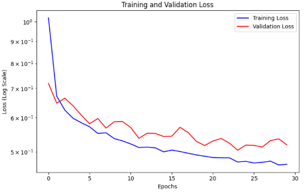
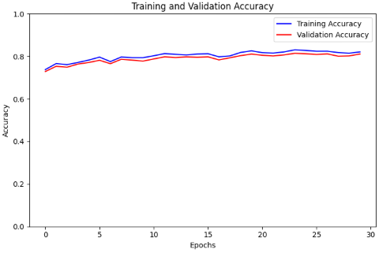
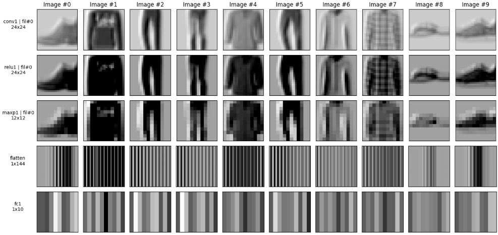

## Análise e Visualização de CNNs com Fashion-MNIST

Este projeto  foca na **construção, treinamento e análise detalhada** de uma Rede Neural Convolucional (CNN) adaptada da arquitetura LeNet-like  para a classificação de imagens do dataset **Fashion-MNIST**.

A atividade principal é utilizar *PyTorch Hooks* para capturar e visualizar as ativações internas (feature maps) das camadas da rede, entendendo como o modelo extrai características visuais para realizar a classificação multiclasse.

---

## 🎯 Objetivo da Atividade

1.  **Adaptação de Dados:** Configurar o carregamento e pré-processamento do dataset **Fashion-MNIST** (10 classes, imagens $28\times28$).
2.  **Construção da Arquitetura:** Implementar uma CNN de bloco único (similar à LeNet-like), ajustando as dimensões de entrada e saída para o Fashion-MNIST.
3.  **Treinamento e Métricas:** Treinar o modelo usando o **Cross-Entropy Loss** e registrar as métricas de perda e acurácia (treino/validação).
4.  **Inspeção da Rede (Hooks):** Utilizar *PyTorch Hooks* para interceptar e capturar os tensores de saída (ativações) de cada camada da CNN.
5.  **Visualização:** Gerar plots dos **filtros aprendidos** e dos **feature maps** intermediários.

---

## 💻 Arquitetura da CNN

O modelo implementado segue a estrutura básica de uma CNN, dividida em um **Featurizer** (extração de características) e um **Classifier** (tomada de decisão).

### 1. Detalhes da Camada

A arquitetura foi ajustada para aceitar o input $1\times28\times28$ do Fashion-MNIST:

| Camada (Module) | Tipo | Parâmetros Chave | Saída (Output Shape) | Função Principal |
| :--- | :--- | :--- | :--- | :--- |
| **Input** | Imagem | $1\times28\times28$ | $1\times28\times28$ | Imagem normalizada |
| `conv1` | `nn.Conv2d` | `kernel_size=5` | $1\times24\times24$ | Extração de bordas/texturas básicas |
| `relu1` | `nn.ReLU` | - | $1\times24\times24$ | Introdução de não-linearidade (zera valores negativos) |
| `maxp1` | `nn.MaxPool2d` | `kernel_size=2` | $1\times12\times12$ | Redução da dimensionalidade e invariância de translação |
| `flatten` | `nn.Flatten` | - | $1\times144$ | Converte o feature map 2D em vetor 1D (Flattened Size = $12\times12=144$) |
| `fc1` | `nn.Linear` | `in=144`, `out=10` | $1\times10$ | Camada oculta de classificação |
| `relu2` | `nn.ReLU` | - | $1\times10$ | Ativação da camada oculta |
| `fc2` | `nn.Linear` | `in=10`, `out=10` | $1\times10$ | Camada de saída (logits para as 10 classes) |

### 2. Parâmetros

* **Dataset:** Fashion-MNIST
* **Total de Classes:** 10
* **Total de Parâmetros Treináveis:** 1910 (baixa complexidade, ideal para análise)
* **Função de Perda:** `nn.CrossEntropyLoss` (usando SGD) 

---

## 🛠️ Detalhes da Implementação

### 1. `Architecture` Class

A classe `Architecture` (no `CNN_FashionMNIST.ipynb`) foi mantida quase idêntica à fornecida, com pequenos ajustes de compatibilidade.

### 2. Uso de Hooks

Os PyTorch Hooks foram registrados nas camadas de interesse (`conv1`, `relu1`, `maxp1`, `flatten`, `fc1`, `relu2`, `fc2`) para inspecionar os tensores de ativação **após o forward pass** (`register_forward_hook`).

Isto permitiu:
* Visualizar o mapa de características gerado após a convolução (`conv1`).
* Verificar o efeito da não-linearidade (ReLU) ao zerar as ativações negativas.
* Observar o *downsampling* espacial do *feature map* após o *pooling* (`maxp1`).

---

## 📊 Resultados e Análise 

### 1. Curvas de Perda (Loss)

O modelo foi treinado por 30 épocas, alcançando uma acurácia de validação de aproximadamente **80%**.

> **Análise da Convergência:**
> As curvas de perda de treino e validação diminuíram rapidamente nas primeiras 5 épocas, convergindo para um platô em torno de 0.5. A perda de validação acompanhou de perto a perda de treino, indicando que o modelo generalizou bem e não apresentou *overfitting* significativo. A baixa complexidade do modelo (poucos filtros) pode ter limitado a acurácia máxima, mas garantiu uma convergência estável.
]
> ]

### 2. Análise dos Feature Maps

> **Interpretação Visual:**
> O **Filtro #0 da camada `conv1`** parece ter aprendido a detectar bordas verticais ou padrões angulares (como é comum em filtros de baixo nível). O **Feature Map após `conv1`** mostra essas bordas ativadas. Após a **`relu1`**, todos os valores negativos foram zerados, resultando em ativações mais esparsas e um mapa mais escuro. Finalmente, a camada **`maxp1`** reduziu o tamanho do *feature map* (de $24\times24$ para $12\times12$), preservando as ativações mais fortes, o que é visível pela semelhança do padrão no mapa reduzido.
> ]

---

## 📺 Vídeo Explicativo

O vídeo a seguir demonstra o processo de desenvolvimento e detalha a análise visual das ativações da rede:

[https://youtu.be/1A-jYQ8Nq3U]

`
